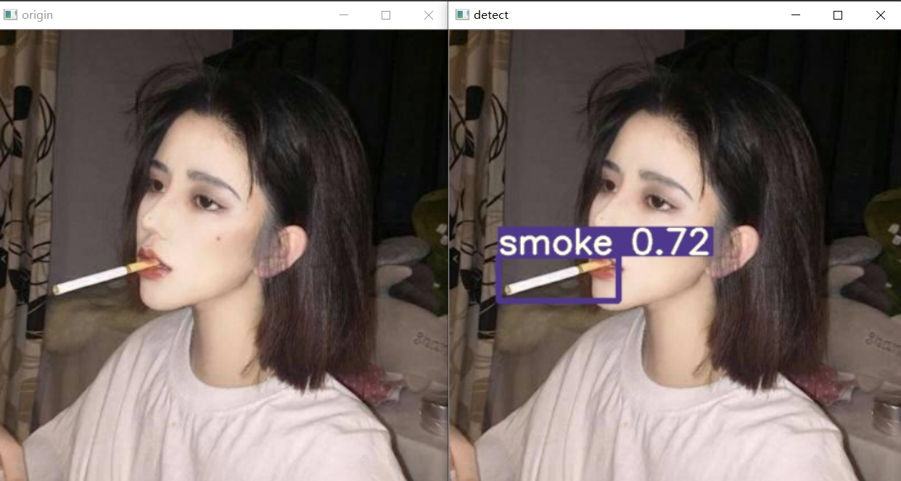
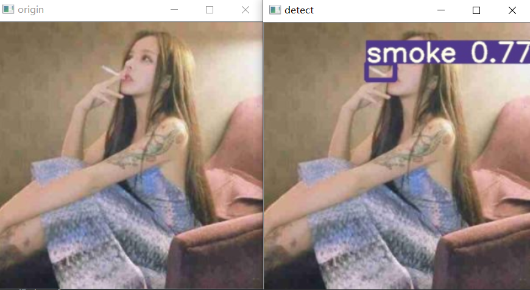
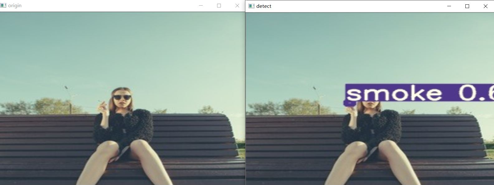

# Smoke-Detect-by-YoloV5

—————————————二次更新———————

那些说bug多的年轻人，我劝你耗子尾汁~，因为我现在各更新了！
把所有可用数据，更新代码讲解，优化，和模型，代码，数据，推理转换，onnx ，openvino 和消融对比，都写好啦~,
大家先看我这篇下面这篇文章，然后公众号回复就能获取全部，不用在这git clone啦~，我公众号回复yolov5香烟    下载好后能直接检测，或者继续训练~

做了模型优化，提高了一些效果，欢迎大家查看这篇文章：https://mp.weixin.qq.com/s/m-bn-Q0dhfav-YsI5b-oLg
详细查看，算法开源了，代码加模型加优化策略加导出加Openvino推理加数据等等，
公众号：DeepAI 视界回复：yolov5香烟领取全部。

### 本原创项目长期更新，旨在完成校园异常行为实时精检测，做到集成+N次开发+优化（不止局限于调包）为止，近期将不断更新以下模型+数据+标注文件+教程。关注博主，Star 一下github，一起开始美妙的目标检测之路吧~~

全部文档参见：

https://blog.csdn.net/qq_46098574/article/details/107334954

## 【项目实战】YOLOV5 +实时吸烟目标检测+手把手教学+开源全部

一、项目展示

左图为原图，右图为推理后的图片，以图片方式展示，视频流和实时流也能达到这个效果，由于视频大小原因，暂不上传，感兴趣的朋友细细往下看，并点个关注哟！

测试配置：GTX1050ti，不堪入目，但是实验效果还不错，再这样弱的配置下，使用YOLOv5s，YOlov5m等皆能达到30fps。
二、项目资源共享
1：训练图片：香烟图片+吸烟手势+烟雾

香烟图片：自己编写爬虫爬了1w张，筛选下来有近1000张可用，以及其他途径获取到的，总共暂时5k张，未来会越来越多，后续需要的可以私聊我，现在先放出5k张图片，另外加上自己辛辛苦苦使用Labelimg标注的几千张图片的XML文件也一并送上，香烟图片质量可查传送门：链接：https://pan.baidu.com/s/1t8u94x51TO7pLciU8AoaiQ
提取码：n2wr：如下图
全部链接传送门

最后再发一次所有的链接！

香烟数据集：链接：https://pan.baidu.com/s/1t8u94x51TO7pLciU8AoaiQ
提取码：n2wr

吸烟手势数据集：链接：https://pan.baidu.com/s/1BSH4yn3GBzF3hDTWAqKzDQ
提取码：9r8t

烟雾数据集：链接：https://pan.baidu.com/s/1RKvkkmfpHiPunkFMAEdoAQ
提取码：ag0x

YOLOv5 原作者github：https://github.com/ultralytics/yolov5

我的github ：https://github.com/CVUsers/Smoke-Detect-by-YoloV5/tree/master 欢迎star ，将长期更新！

最后还有很多知识点没分享，关注一下博主，下次分享。

另外欢迎加入深度学习算法交流群，与群内工程师朋友门一起交流学术，共商算法，加油！

——————————————————————二次更新——————

做了模型优化，提高了一些效果，欢迎大家查看这篇文章：https://blog.csdn.net/l641208111/article/details/109286497
详细查看，算法开源了，代码加模型加优化策略加导出加Openvino推理加数据等等，
公众号：DeepAI 视界回复：yolov5香烟领取全部。
